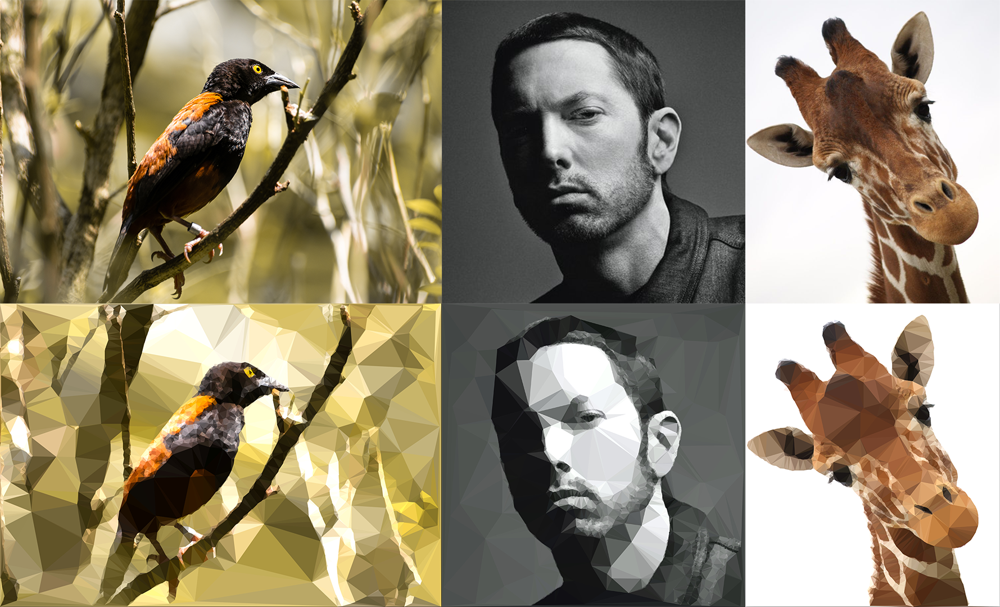

# LowPolyPy

Generate Low-Poly Versions of Images:



## Getting Started

These instructions will get you a copy of the project up and running on your local machine for development and testing purposes.

I'm currently working on wrapping these scripts in a Django project and getting it hosted on Heroku.

### Prerequisites

Clone this repository and navigate to the project directory:

```bash
git clone https://github.com/tasercake/lowpolypy
cd lowpolypy
```

### Installing

> Lowpolypy can't be installed via `pip` (yet), but the setup is simple nonetheless.

Install dependencies:

```bash
pip install -r requirements.txt
```

### Try It Out

From the root of the project directory, run

```bash
python -m lowpolypy run './images/giraffe.jpg'
```

This should create a new image in the `images` directory.

## Built With

* [OpenCV](https://opencv.org/releases/) - Image manipulation library
* [PIL](https://pillow.readthedocs.io/en/stable/) - For easy(er) image I/O
* [NumPy & SciPy](https://www.scipy.org/) - Matrix ops, Triangulation, Voronoi tesselation, etc.

## License

This project is licensed under the MIT License - see the [LICENSE.md](LICENSE.md) file for details
